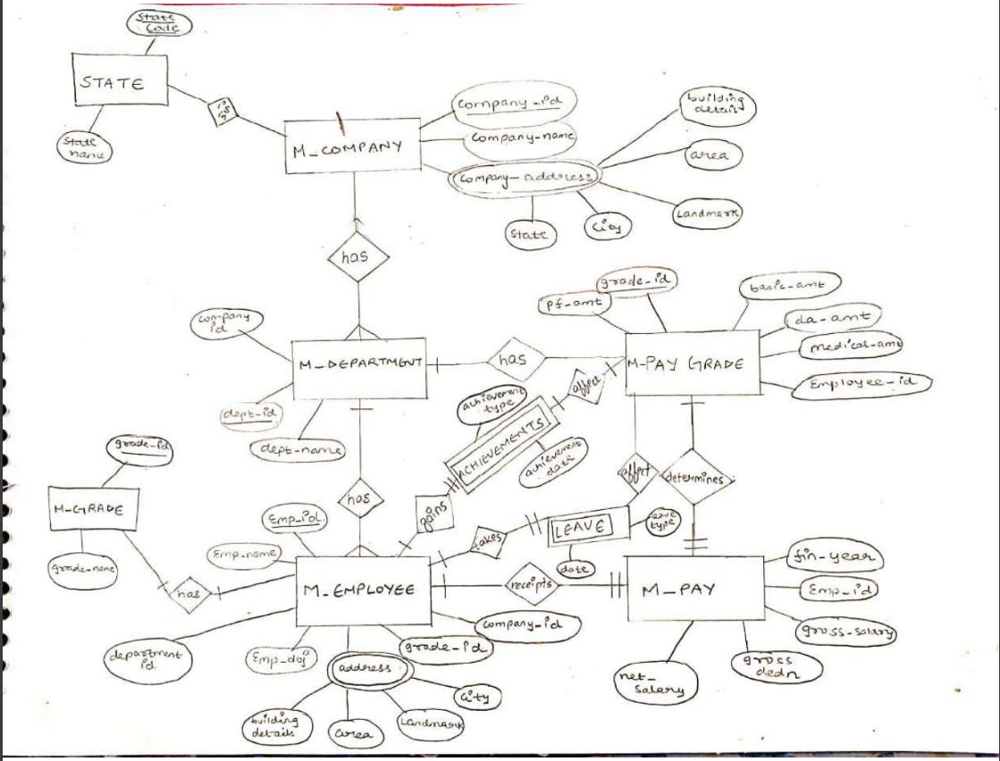
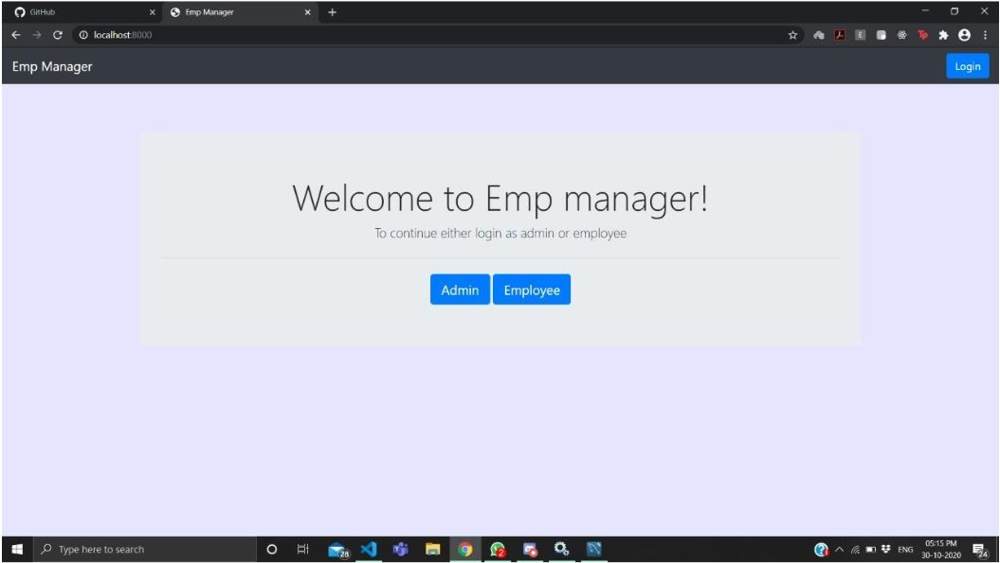
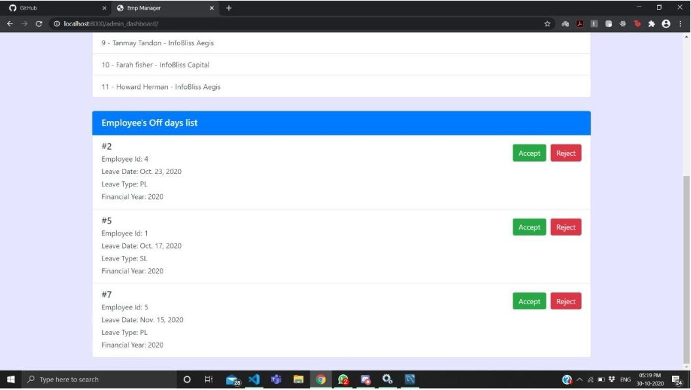
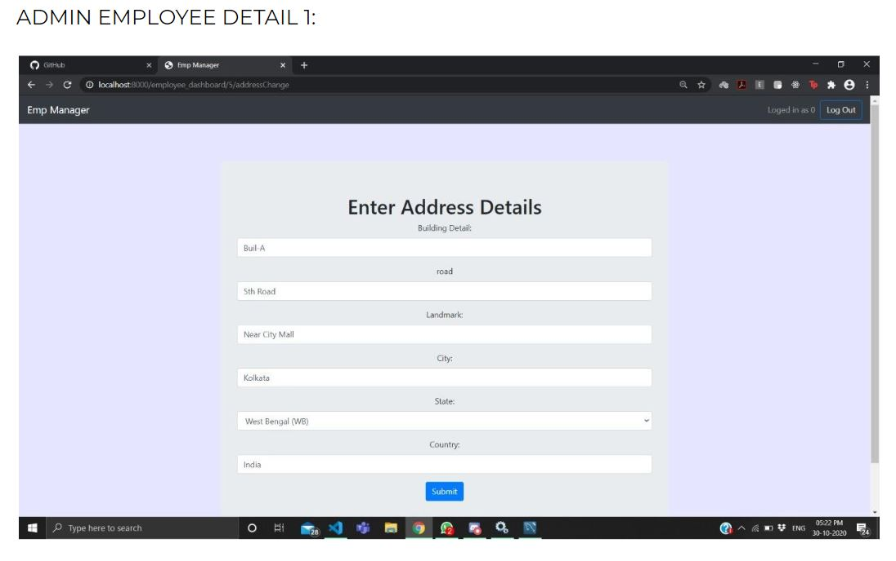
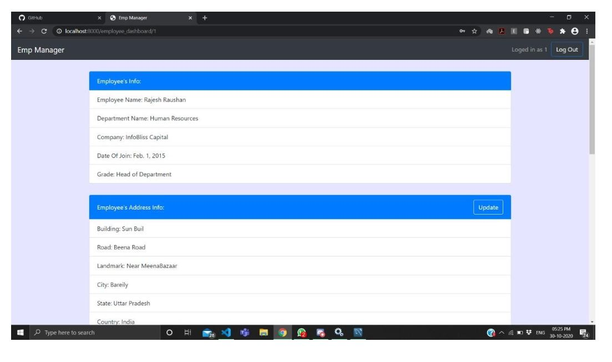
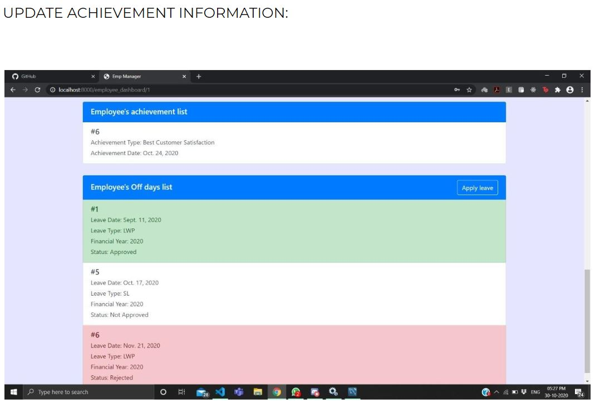
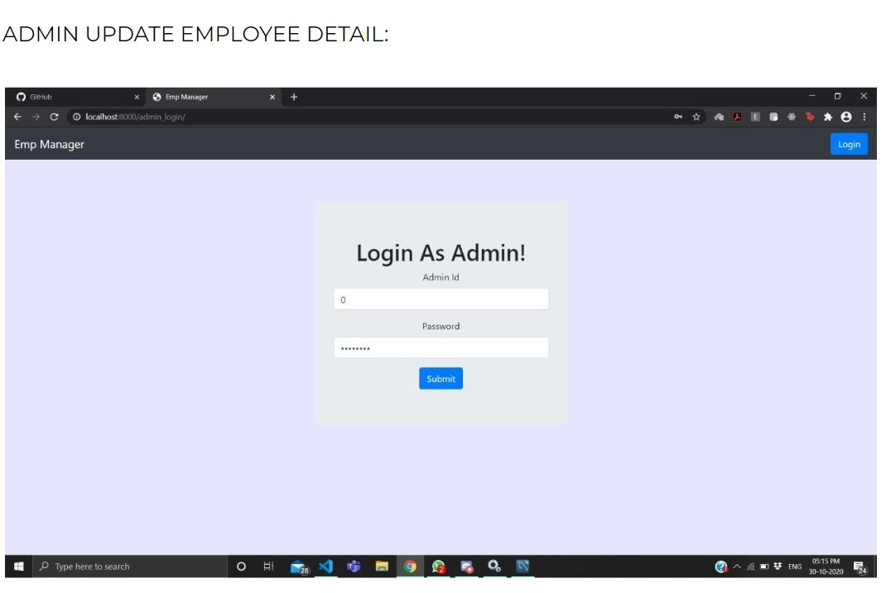
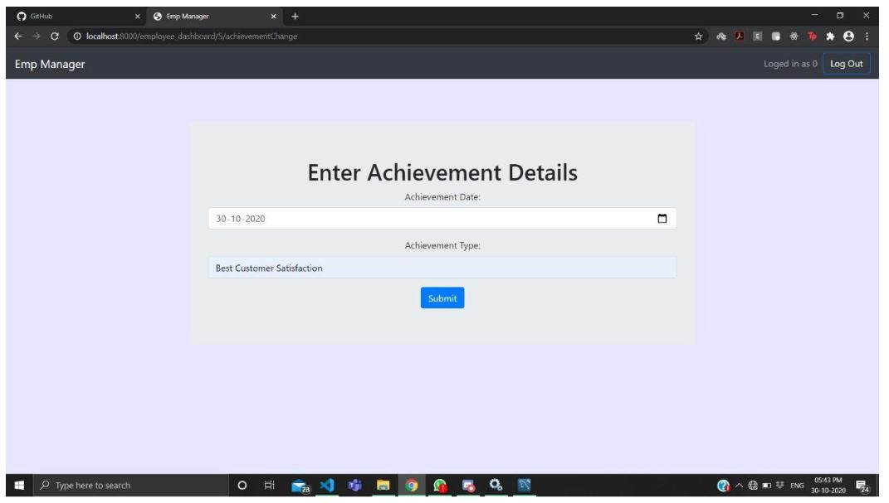

# Infobliss
Through pigeonesis we have shown how people can stay connected with others life and also allowing others to be a part of their life. Various interesting features have been added along with a very important feature which is 'the blocking feature'. Through this website we have tried to help as many people as possible in such difficult times where all people fear is loneliness and isolation. In this project we tried to implement the things we got to learn during the Internet Web Programming class. We got a chance to put the learned knowledge into practice and gain a lot of practical knowledge. Also we explored a new language, Django. Overall, this project was a great additional learning bonus for us as developers, hope it adds value to your life as well.

Software Requirements for the Project are:

        1.Virtual Environment - pipenv.
            Can be installed by the command "pipenv install"
            Can be activated by the command "pipenv shell"
        2.Python 3 installed.
        3.Django 3 installed.
        4.Dotenv Installed.
        5.To host the Project on the Local Server:
            Go to the Source Folder and type - 
               "python manage.py makemigrations"
               "python manage.py migrate"
               "python manage.py runserver"
        6.The Site can be enjoyed at your Localhost, on your desired browser.

  
  
  
  
  
  
  
  

